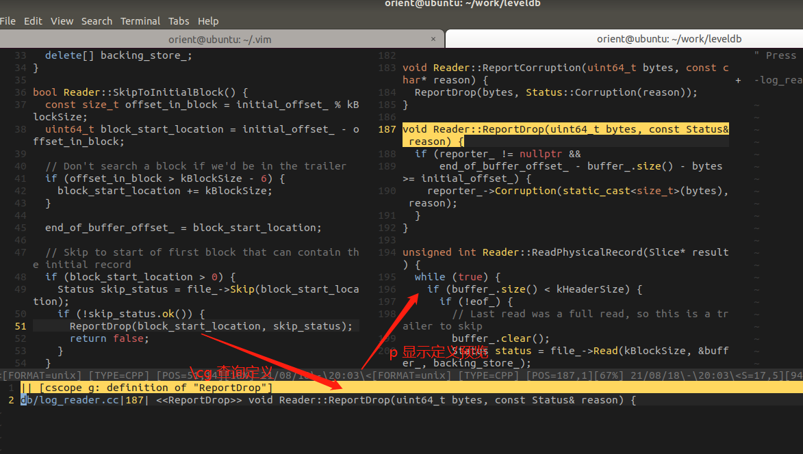
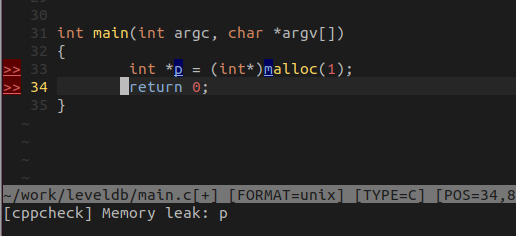
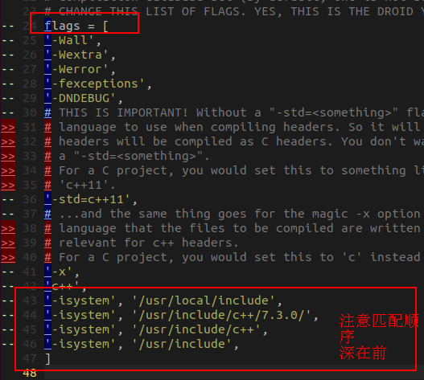
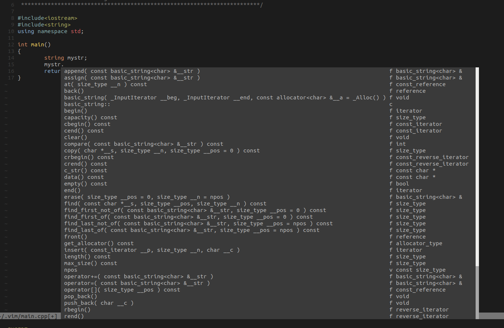
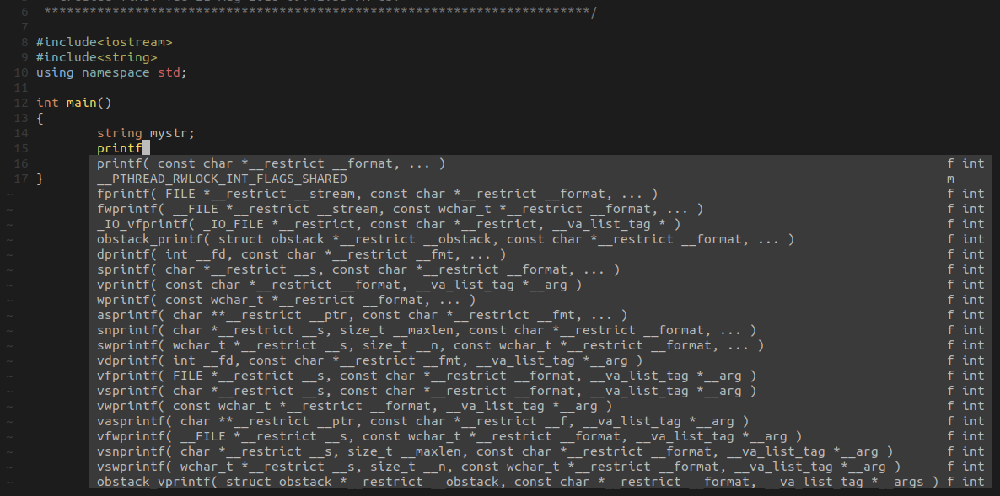
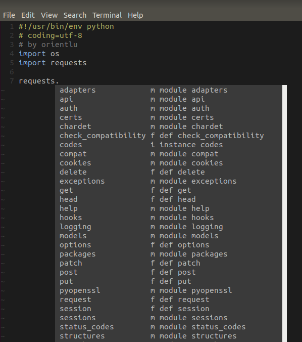
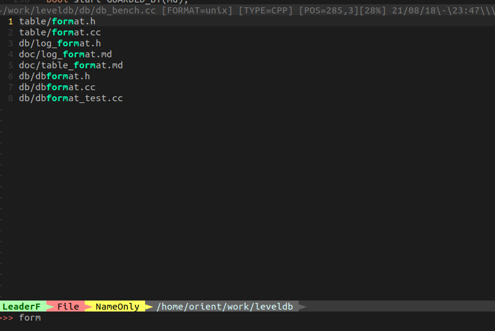
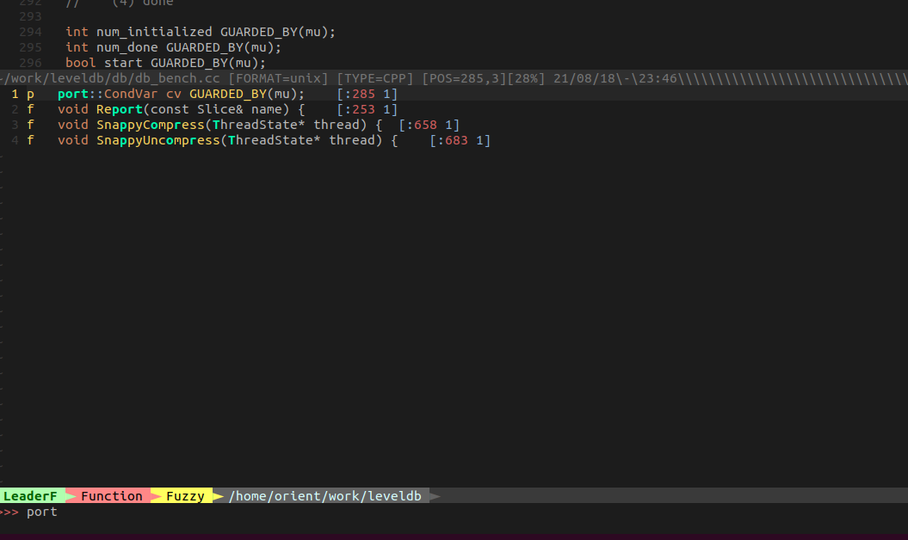
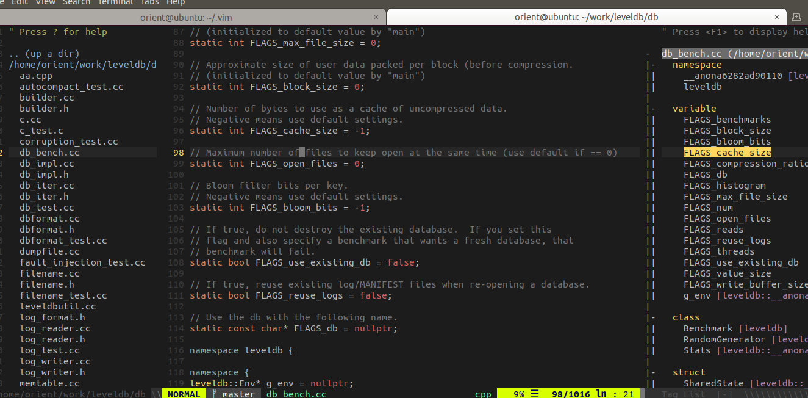
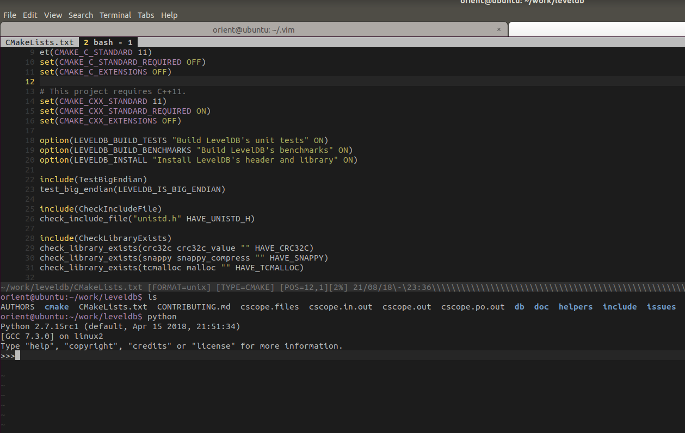

# 2018 更新下vim 插件
@(linux 编程)[工具使用]

周末网上晃荡看到一些关于 vim8 异步和插件的文章，觉得有些新功能挺实用的，所以花了点时间升级下自己的 vim 配置。
本文介绍一些使用到的实用插件以及参考配置。

on ubuntu 18

---

## 插件管理
### [vim-plug](https://github.com/junegunn/vim-plug)
之前使用的插件管理工具是 vundle， 没感觉啥问题，但是当看到 vim-plug 以下特点：	
* 安装方便，直接把 vim-plug.vim 丢 .vim/autoload 下就好了
* 支持全异步插件安装、升级
* 延迟加载，提高 vim 启动速度 

我就果断抛弃 vundle，把插件管理工具改为她了。
安装配置和使用详细参考 git 主页，使用方式和 bundlue 类似 ``:PlugInstall``,``:PlugUpgrade``等。

vimrc 中 配置类似：
```vim
call plug#begin('~/.vim/plugged') "开始，指定插件安装目录
Plug 'junegunn/vim-easy-align'  
Plug 'scrooloose/nerdtree', { 'on':  'NERDTreeToggle' }  "触发时才加载
Plug 'tpope/vim-fireplace', { 'for': 'clojure' } 		"打开对应文件才加载
Plug 'rdnetto/YCM-Generator', { 'branch': 'stable' }  "选择插件分支
Plug 'fatih/vim-go', { 'do': ':GoInstallBinaries' }  "安装插件时执行命令
"....
call plug#end()  "结束
```

## 符号索引
看源码的时候经常需要跳转，查看函数定义、被哪些地方调用，在 windows 下可以使用 source insight 等工具查看；
linux 下，之前用 vim 一直靠 ctags + cscope 看 c/c++，插件 jedi 查看 python 代码，其他语言没有，而且每次代码修改，都需要手动重新生成索引，感觉挺麻烦的。

在知乎看到这篇  <[Vim8中C/C++符号索引：GTags 篇](https://zhuanlan.zhihu.com/p/36279445) >，vim8 支持异步模式后，自动符号索引简直太方便，直接打开工程文件，就可以随便查查查。

安装配置详细参考文章，大概基本步骤如下：
* 重新安装 ctags，使用 [Universal CTags](https://github.com/universal-ctags/ctags) (默认的软件源都是Exuberant Ctags，版本太旧了)
```
"正确设置vimrc，读取tags（当前目录，否则向上级目录查找添加 .tags）
set tags=./.tags;,.tags
```
* 安装 [gtags](https://www.gnu.org/software/global/download.html) (系统软件源一般版本比较低，建议自己编译安装)
gtags 原生支持 6 种语言（C，C++，Java，PHP4，Yacc，汇编）， 通过安装 ``pygments``扩展支持 50+ 种语言（包括 go/rust/scala 等，基本覆盖所有主流语言。

```
pip install pygments
```
```
"vimrc 中设置环境变量启用 pygments
let $GTAGSLABEL = 'native-pygments'
let $GTAGSCONF = '/usr/local/share/gtags/gtags.conf' " 此路径根据实际设置（find一下）
```

* 安装三个插件 : [vim-gutentags 索引自动管理](https://github.com/ludovicchabant/vim-gutentags) + [索引数据库切换](https://github.com/skywind3000/gutentags_plus) + [索引预览](https://github.com/skywind3000/vim-preview) 
按下面 vimrc  配置后打开 vim 执行``:PlugInstall`` 完成插件安装，然后就可以开心使用了。
预设快捷键如下
	* ``<leader>cg`` - 查看光标下符号的定义
	* ``<leader>cs`` - 查看光标下符号的引用
	* ``<leader>cc`` - 查看有哪些函数调用了该函数
	* ``<leader>cf ``- 查找光标下的文件
	* ``<leader>ci``- 查找哪些文件 include 了本文件
查找到索引后跳到弹出的 quikfix 窗口，停留在想查看索引行上，按 ``小P``直接打开预览窗口，``大P``关闭预览，``\d`` 和 ``\u`` 向上向下滚动预览窗口。

vimrc 配置如下：

```
"自动载入ctags gtags
if version >= 800
    Plug 'ludovicchabant/vim-gutentags'
    Plug 'skywind3000/gutentags_plus'

    let $GTAGSLABEL = 'native-pygments'
    let $GTAGSCONF = '/usr/local/share/gtags/gtags.conf'

    " gutentags 搜索工程目录的标志，当前文件路径向上递归直到碰到这些文件/目录名
    let g:gutentags_project_root = ['.root', '.svn', '.git', '.hg', '.project']

    " 所生成的数据文件的名称
    let g:gutentags_ctags_tagfile = '.tags'

    " 同时开启 ctags 和 gtags 支持：
    let g:gutentags_modules = []
    if executable('ctags')
        let g:gutentags_modules += ['ctags']
    endif
    if executable('gtags-cscope') && executable('gtags')
        let g:gutentags_modules += ['gtags_cscope']
    endif

    " 将自动生成的 ctags/gtags 文件全部放入 ~/.cache/tags 目录中，避免污染工程目录
    let g:gutentags_cache_dir = expand('~/.cache/tags')

    " 配置 ctags 的参数
    let g:gutentags_ctags_extra_args = ['--fields=+niazS', '--extra=+q']
    let g:gutentags_ctags_extra_args += ['--c++-kinds=+px']
    let g:gutentags_ctags_extra_args += ['--c-kinds=+px']

    " 如果使用 universal ctags 需要增加下面一行
    let g:gutentags_ctags_extra_args += ['--output-format=e-ctags']

    " 禁用 gutentags 自动加载 gtags 数据库的行为
    " 避免多个项目数据库相互干扰
    " 使用plus插件解决问题
    let g:gutentags_auto_add_gtags_cscope = 0

    "预览 quickfix 窗口 ctrl-w z 关闭
    Plug 'skywind3000/vim-preview'
    "P 预览 大p关闭
    autocmd FileType qf nnoremap <silent><buffer> p :PreviewQuickfix<cr>
    autocmd FileType qf nnoremap <silent><buffer> P :PreviewClose<cr>
    noremap <Leader>u :PreviewScroll -1<cr> " 往上滚动预览窗口
    noremap <leader>d :PreviewScroll +1<cr> "  往下滚动预览窗口
endif
```

有个地方需要注意，配置中定义了项目标志文件为 ``.git, .svn, .root, .project, .hg..``, 让 gutentags 可以**确定当前文件所属项目的根目录**，我们在当前目录打开文件后 guntentags 开始向父目录递归查找，直到找到这些标志文件时停止，对于没有 .git 之类标志文件的工程，可以在自己认为的根目录新建  .root 之类的文件作为标志。

效果图如下：



## 动态检查
静态代码检查是个很实用的东西，能在编写代码的过程中及时发现存在的错误，之前一直使用的插件是 [syntastic](https://blog.csdn.net/Demorngel/article/details/69053443),  vim8 支持异步后可以升级实时 linting 工具 [ALE](https://link.zhihu.com/?target=https%3A//github.com/w0rp/ale)

使用配置如下：

```
  Plug 'w0rp/ale'
" 对应语言需要安装相应的检查工具
" https://github.com/w0rp/ale
"    let g:ale_linters_explicit = 1 "除g:ale_linters指定，其他不可用
"    let g:ale_linters = {
"\   'cpp': ['cppcheck','clang','gcc'],
"\   'c': ['cppcheck','clang', 'gcc'],
"\   'python': ['pylint'],
"\   'bash': ['shellcheck'],
"\   'go': ['golint'],
"\}
"
    let g:ale_sign_column_always = 1
    let g:ale_completion_delay = 500
    let g:ale_echo_delay = 20
    let g:ale_lint_delay = 500
    let g:ale_echo_msg_format = '[%linter%] %code: %%s'
    let g:ale_lint_on_text_changed = 'normal'
    let g:ale_lint_on_insert_leave = 1
    let g:airline#extensions#ale#enabled = 1
    "let g:ale_set_quickfix = 1
    "let g:ale_open_list = 1"打开quitfix对话框

    let g:ale_c_gcc_options = '-Wall -O2 -std=c99'
    let g:ale_cpp_gcc_options = '-Wall -O2 -std=c++14'
    let g:ale_c_cppcheck_options = ''
    let g:ale_cpp_cppcheck_options = ''

    let g:ale_sign_error = ">>"
    let g:ale_sign_warning = "--"
    map <F7> ::ALEToggle<CR>
```
ALE 支持多种语言的代码检查，前提是系统**已经安装**了对应的工具（git 主页可见语言及对应工具），诸如 ``clang cppcheck pylint shellcheck golint``等。
安装插件后打开 vim 编辑文件，可以看到检查效果了，可以设置多个检查工具检查不同维度错误，多个工具是并发进行检查的。

cppcheck 检查出指针泄漏，提出编码建议


暂时关闭代码检查``:ALEDisable``， 上述配置设置了快捷键 F7，``:ALEDetail``查看纤细描述等；


## 自动补全

vim 本身自带有补全功能，但是比较弱鸡，所以还是推荐百年老字号 [YCM](https://link.zhihu.com/?target=https%3A//github.com/Valloric/YouCompleteMe)，最新版本 YCM 已经全异步化，弹出语义补全毫不卡顿。
安装过程需要编译 ycm_core 库，所以有点久。
参考配置 

```
Plug 'Valloric/YouCompleteMe', {'do':'./install.py --clang-completer --go-completer --java-completer'}
set completeopt=menu,menuone "关闭自动弹出的窗口
let g:ycm_add_preview_to_completeopt = 0
let g:ycm_show_diagnostics_ui = 0
let g:ycm_server_log_level = 'info'
let g:ycm_min_num_identifier_candidate_chars = 2
let g:ycm_collect_identifiers_from_comments_and_strings = 1
let g:ycm_complete_in_strings=1
let g:ycm_key_invoke_completion = '<c-y>'
set completeopt=menu,menuone
noremap <c-y> <NOP>
let g:ycm_semantic_triggers =  {
			\ 'c,cpp,python,java,go,erlang,perl': ['re!\w{2}'],
			\ 'cs,lua,javascript': ['re!\w{2}'],
			\ }
let g:ycm_global_ycm_extra_conf= '~/.vim/.ycm_extra_conf.py'

"附送 括号自动补全
Plug 'jiangmiao/auto-pairs'
```
以上配置 [参考](https://zhuanlan.zhihu.com/p/33046090)

Plug 插件管理安装 YCM 后执行脚本 build.py 编译 ycm_core 库，指定了支持的语言系，如果有其他语言需求需要在安装编译时对应添加语义 flag。

**对于  C-family 工程，ycm 需要配置文件 .ycm_extra_conf.py 才能进行语义补全提示(include 库之类的路径)**，
在上述配置中，最后设置 ：
``let g:ycm_global_ycm_extra_conf= '~/.vim/.ycm_extra_conf.py'``
ycm 尝试从当前目录往上查找读取 .ycm_extra_conf.py 文件导入，最后如果没有找到就使用这个默认配置文件（参考插件例子 ~/.vim/plugged/YouCompleteMe/third_party/ycmd/examples/.ycm_extra_conf.py）。
如果自己工程编译参数，include 不同，可以拷贝默认配置文件修改 flags 后直接放在工程目录下。也可以使用 ycm 提供的 [配置文件生成工具](https://github.com/rdnetto/YCM-Generator)

默认的 ycm_extra_conf 文件定义编译 flags 如下



语义补全效果（文件前面没有写过的符号）：
类方法

库函数

python



## 查找
[leaderF](https://github.com/Yggdroot/LeaderF) 用于快速模糊查找文件或者函数
简单配置如下

```
Plug 'Yggdroot/LeaderF', { 'do': './install.sh' }
" Ctrl + p 打开文件搜索
let g:Lf_ShortcutF = '<c-p>'    
"\p 打开函数列表
noremap <Leader>p :LeaderfFunction<cr>
```

[快捷键](https://github.com/Yggdroot/LeaderF/blob/master/doc/leaderf.txt)
* ``<ctrl-p>``: 查找文件
* ``\p``: 查找函数
* ``<Ctrl-J>, 向下, <Ctrl-K>, 向上`` 
* ``<Ctrl-X>`` : open in horizontal split window.
* ``<Ctrl-]>`` : open in vertical split window.
* ``<Ctrl-T>`` : open in new tabpage.

使用效果 :
搜索文件 ： ctrl-p

搜索函数 ： \p



## 目录列表
左 nerdtree 右 taglist，老插件了。



* [NERDTree](https://www.vim.org/scripts/script.php?script_id=1658)
此插件显示文件目录

```
**
"当打开vim且没有文件时自动打开NERDTree
autocmd vimenter * if !argc() | NERDTree | endif
" 只剩 NERDTree时自动关闭
autocmd bufenter * if (winnr("$") == 1 && exists("b:NERDTreeType") && b:NERDTreeType == "primary") | q | endif
let NERDTreeShowLineNumbers=1
let NERDTreeAutoCenter=1
let NERDTreeShowHidden=1
let NERDTreeIgnore=['\.pyc','\~$','\.swp','\.git']

map <silent><F3> :NERDTreeToggle<CR>
imap <F3> <ESC> :NERDTreeToggle<CR>
```

* [Taglist](https://github.com/vim-scripts/taglist.vim)
taglist依赖于ctags，所以要先装ctags；
此插件显示打开文件的符号，命名空间，类名等。

```
"默认打开Taglist
let Tlist_Sort_Type = "name"    " 按照名称排序
let Tlist_Auto_Open=0
let Tlist_Ctags_Cmd = '/usr/local/bin/ctags'
let Tlist_File_Fold_Auto_Close = 1
let Tlist_Exit_OnlyWindow = 1 "如果taglist窗口是最后一个窗口，则退出vim
let Tlist_Use_Right_Window = 1 "在右侧窗口中显示taglist窗口
let Tlist_Compart_Format = 1    " 压缩方式
let Tlist_Exist_OnlyWindow = 1  " 如果只有一个buffer，kill窗口也kill掉buffer
let Tlist_Show_One_File=1            "不同时显示多个文件的tag，只显示当前文件的
```

## 其他插件
* [vim-signify 修改标记](https://github.com/mhinz/vim-signify)
通过 signify 这个插件，对于打开有版本控制的文件，可以在文件侧边实时显示文件的修改情况。
``:SignifyDiff`` 可以直接打开新 tab 对比版本差异，常用可以设置快捷键触发


* [python换行格式化](https://zhuanlan.zhihu.com/p/38152472)
换行的时候，自动格式化下 python ，详见链接。

* [ConqueTerm terminal](https://github.com/vim-scripts/Conque-Shell)
在 vim 中直接打开一个 bash ，效果如下：
``:ConqueTermSplit bash``


另外一个在vim中打开终端的插件 [python-repl](https://zhuanlan.zhihu.com/p/37231865)
 
* [mark 高亮单词](https://www.vim.org/scripts/script.php?script_id=1238)
光标停靠在需要高亮的单词，然后直接键入 ：
	* ``\m``  高亮单词
	* ``\n``   清除
	* ``\r`` 根据正则高亮git 
	* ``\*``    下一个
	* ``\#``   上一个
* [airline 状态栏](https://github.com/vim-airline/vim-airline)
* [c/c++ 语法高亮丰富下](https://github.com/octol/vim-cpp-enhanced-highlight)


---

以上插件，你可以在终端直接执行(Ubuntu18)

```bash
wget -qO- https://raw.githubusercontent.com/orientlu/vim/master/setup.sh | sh -x
```
安装配置好的vim，需要手动升级ctags和gtags，参考 install_tags.md


---
## 参考
* [插件_for_vim8](https://www.zhihu.com/question/47691414/answer/373700711)
* [vim8 gtags索引](https://zhuanlan.zhihu.com/p/36279445)
* [旧十大插件？？](http://www.open-open.com/lib/view/open1414227253419.html)
* [vimrc 参考](http://edyfox.codecarver.org/html/_vimrc_for_beginners.html)